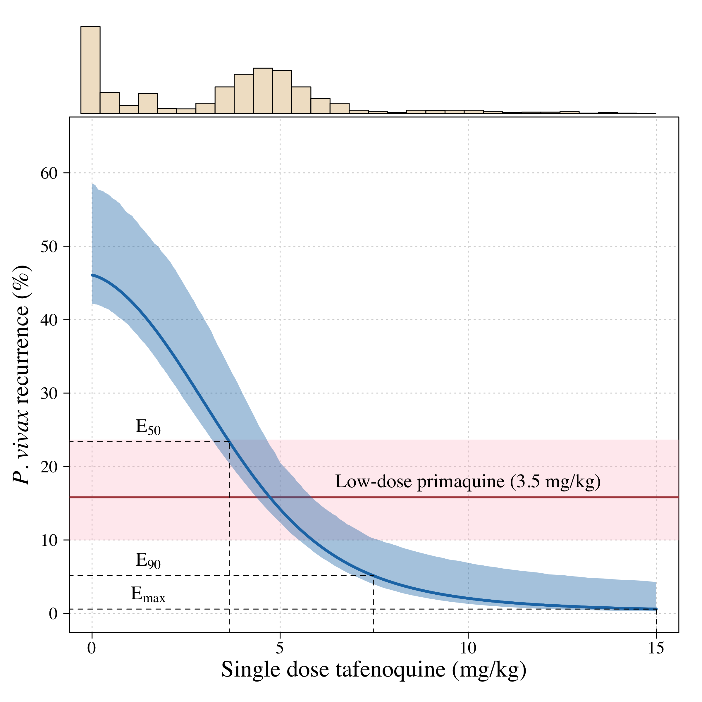

# Tafenoquine-efficacy

The clinical pharmacology of tafenoquine in the radical cure of Plasmodium vivax malaria: an individual patient data meta-analysis

This github repo provides code underlying the analysis of our paper published in eLife (in press,  [preprint version with peer review comments](https://www.medrxiv.org/content/10.1101/2022.09.12.22279840v1)). The data cannot be made open access as they belong to GSK. They can be obtained by subimitted a data request to the CSDR website.

This work characterises the relationship between the mg/kg dose of tafenoquine and recurrence at 4 months. We show that the tafenoquine dose is the primary determinant of efficacy; that day 7 methaemoglobin is a predictor of efficacy; that more rapid elimination of the parent compound is a predictor of efficacy. All plots in the paper are generated using the RMarkdown script *TQ_efficacy.Rmd*. The main result is the following Emax model fit:

Any questions please email me at jwatowatson at gmail dot com
