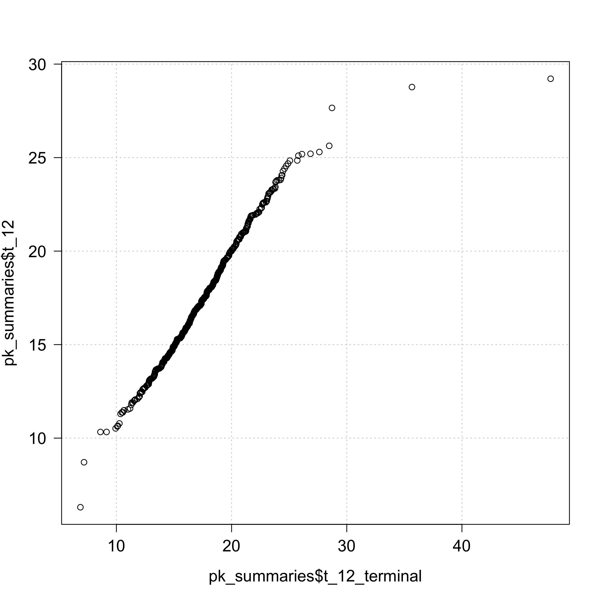
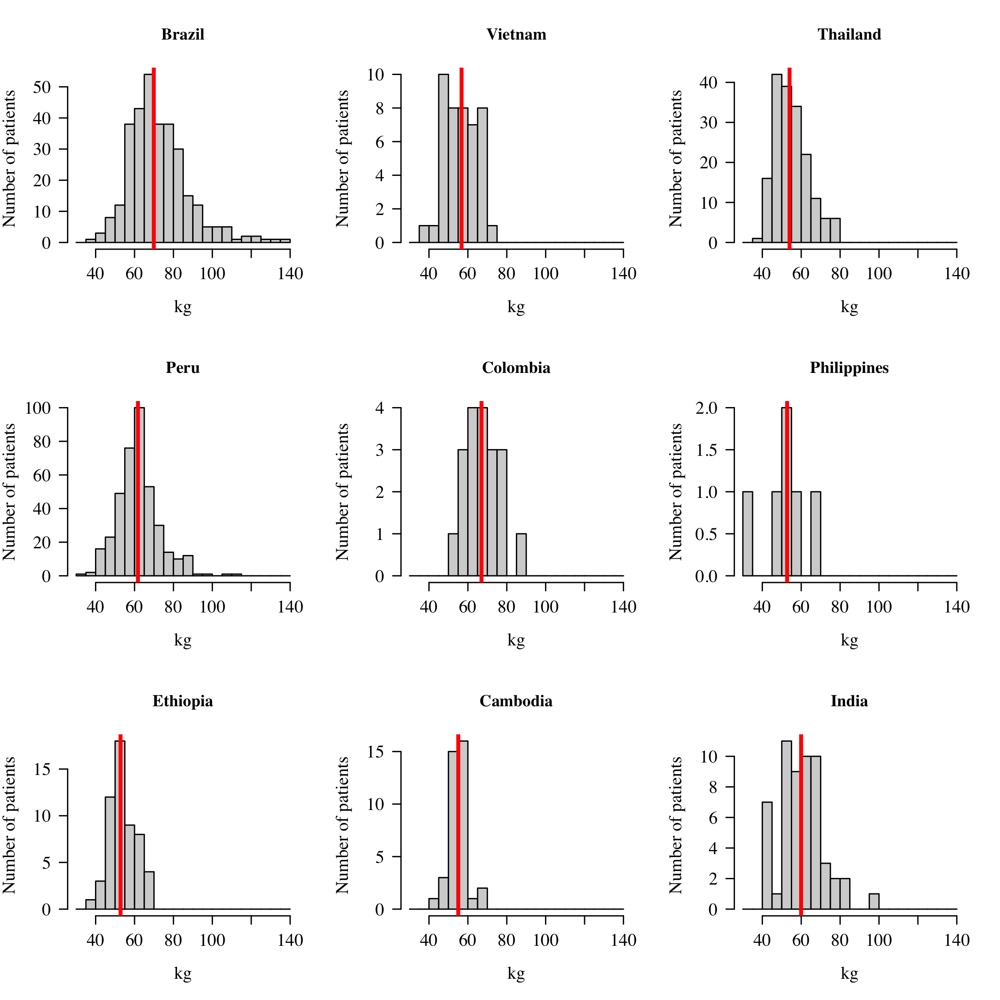
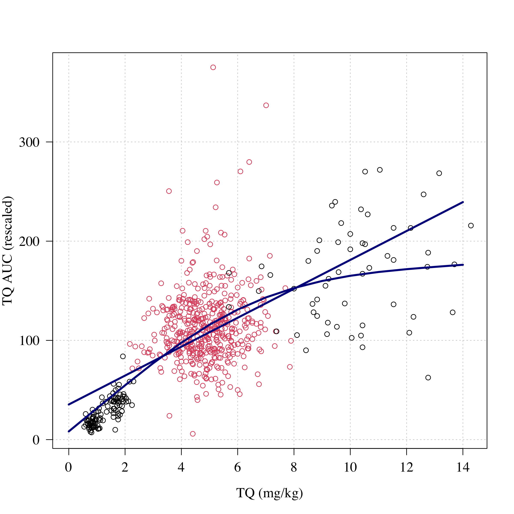

TODO:

-   Paper: check effect in volunteers
-   Association with weight (just in placebo arms)

# Preambule

## Load data


```
## 
## DETECTIVE_Ph2 DETECTIVE_Ph3        GATHER 
##           329           522           251
```

```
## TQ doses in efficacy analyses:
```

```
## 
## No Radical Cure            PQ15           TQ100           TQ300            TQ50 
##             186             265              56             482              55 
##           TQ600 
##              56
```

```
## [1] 482
```

```
## [1] 7.692307
```

```
## [1] 4.929577
```

```
## 27 patients were lost to follow-up before 1 month
```

```
## 39 patients were lost to follow-up before 4 months
```

```
## 125 patients were lost to follow-up before 6 months
```

```
## 
## No Radical Cure            PQ15           TQ100           TQ300            TQ50 
##             182             257              56             469              54 
##           TQ600 
##              55
```

```
## A total of 634 patients received TQ in the efficacy population with doses varying from 0.5 to 14.3 mg/kg
```

```
## 
##   0   1 
## 775 298
```

```
## 
##   0   1 
## 713 360
```

```
## Warning: NAs introduced by coercion
```


<!-- --><!-- --><!-- -->

```
## The median half life is 16.8 days
```

<!-- -->

```
## 
## 	Pearson's product-moment correlation
## 
## data:  pk_summaries$t_12_bw_adjusted and pk_summaries$BW
## t = -0.098444, df = 636, p-value = 0.9216
## alternative hypothesis: true correlation is not equal to 0
## 95 percent confidence interval:
##  -0.08150116  0.07374116
## sample estimates:
##         cor 
## -0.00390352
```


# Data summaries

## Table 1


```
##             tqcat tqmgkgtot
## 1 No radical cure  0.000000
## 2              PQ  0.000000
## 3     [0.01,3.75)  1.987331
## 4     [3.75,6.25)  4.893435
## 5     [6.25,8.75)  6.936322
## 6       [8.75,15] 10.696189
```

```
##             tqcat mean   n total
## 1 No radical cure 55.5 101   182
## 2              PQ 22.2  57   257
## 3     [0.01,3.75) 33.7  57   169
## 4     [3.75,6.25) 21.5  79   368
## 5     [6.25,8.75)  7.4   4    54
## 6       [8.75,15]  0.0   0    43
```

```
## mean age:
```

```
##             tqcat age
## 1 No radical cure  35
## 2              PQ  36
## 3     [0.01,3.75)  37
## 4     [3.75,6.25)  36
## 5     [6.25,8.75)  36
## 6       [8.75,15]  33
```

```
## SD age:
```

```
##             tqcat  age
## 1 No radical cure 14.1
## 2              PQ 14.4
## 3     [0.01,3.75) 13.4
## 4     [3.75,6.25) 14.2
## 5     [6.25,8.75) 17.2
## 6       [8.75,15] 14.4
```

```
##             tqcat sex
## 1 No radical cure  50
## 2              PQ  77
## 3     [0.01,3.75)  43
## 4     [3.75,6.25)  95
## 5     [6.25,8.75)  24
## 6       [8.75,15]   9
```

```
##             tqcat sex
## 1 No radical cure  27
## 2              PQ  30
## 3     [0.01,3.75)  25
## 4     [3.75,6.25)  26
## 5     [6.25,8.75)  44
## 6       [8.75,15]  21
```

```
##             tqcat weight
## 1 No radical cure     62
## 2              PQ     63
## 3     [0.01,3.75)     72
## 4     [3.75,6.25)     63
## 5     [6.25,8.75)     51
## 6       [8.75,15]     57
```

```
##             tqcat weight
## 1 No radical cure   12.0
## 2              PQ   12.1
## 3     [0.01,3.75)   20.1
## 4     [3.75,6.25)    8.7
## 5     [6.25,8.75)   13.3
## 6       [8.75,15]    7.3
```

```
##              
##               No radical cure  PQ [0.01,3.75) [3.75,6.25) [6.25,8.75) [8.75,15]
##   Brazil                   55  80          61         105           6         3
##   Cambodia                 10   8           0          16           2         0
##   Colombia                  0   5           0          11           0         0
##   Ethiopia                 14  13           0          18           7         0
##   India                     9   5          21           8           4         7
##   Peru                     62  91          56         136          21        18
##   Philippines               1   2           0           3           0         0
##   Thailand                 31  38          31          46          10        15
##   Vietnam                   0  15           0          25           4         0
```

```
##              
##               No radical cure PQ [0.01,3.75) [3.75,6.25) [6.25,8.75) [8.75,15]
##   Brazil                   30 31          36          29          11         7
##   Cambodia                  5  3           0           4           4         0
##   Colombia                  0  2           0           3           0         0
##   Ethiopia                  8  5           0           5          13         0
##   India                     5  2          12           2           7        16
##   Peru                     34 35          33          37          39        42
##   Philippines               1  1           0           1           0         0
##   Thailand                 17 15          18          12          19        35
##   Vietnam                   0  6           0           7           7         0
```

```
##             tqcat logpara0.0% logpara0.25% logpara0.50% logpara0.75%
## 1 No radical cure          30         2173         5470        11856
## 2              PQ         104         1712         4697        10430
## 3     [0.01,3.75)         129         1447         4320         9456
## 4     [3.75,6.25)         102         1431         4174        10101
## 5     [6.25,8.75)         151         1961         5507        12111
## 6       [8.75,15]         200         1692         6143        13313
##   logpara0.100%
## 1         66010
## 2         87380
## 3         51175
## 4         99604
## 5         80535
## 6         56100
```

```
##             tqcat hbday0.1 hbday0.2
## 1 No radical cure     12.9      1.5
## 2              PQ     13.0      1.6
## 3     [0.01,3.75)     12.9      1.8
## 4     [3.75,6.25)     13.2      1.6
## 5     [6.25,8.75)     12.3      1.8
## 6       [8.75,15]     12.6      1.8
```

## PK data plot

For supplementary materials


```
## Rows: 5218 Columns: 19
## ── Column specification ────────────────────────────────────────────────────────
## Delimiter: ","
## chr (11): #ID, TIME, AMT, ODV, LNDV, AGE, SEX, BW, ACT, DAY_PERIOD, PID
## dbl  (8): MDV, BLQ, CMT, EVID, TYPE, VOMIT, STUDY, COUNTRY
## 
## ℹ Use `spec()` to retrieve the full column specification for this data.
## ℹ Specify the column types or set `show_col_types = FALSE` to quiet this message.
```

```
## there are a total of 4384 concentrations above LOQ in 718 patients
```

```
## there are a total of 115 concentrationsBLQ in 718 patients
```

<!-- --><!-- -->

## Kaplan Meier time to recurrence


```
## [1] 182 257 169 368  54  43
```

<!-- -->


```
##              
##               No radical cure  PQ [0.01,3.75) [3.75,6.25) [6.25,8.75) [8.75,15]
##   Brazil                   55  80          61         105           6         3
##   Cambodia                 10   8           0          16           2         0
##   Colombia                  0   5           0          11           0         0
##   Ethiopia                 14  13           0          18           7         0
##   India                     9   5          21           8           4         7
##   Peru                     62  91          56         136          21        18
##   Philippines               1   2           0           3           0         0
##   Thailand                 31  38          31          46          10        15
##   Vietnam                   0  15           0          25           4         0
```

```
## Range of mg/kg weights:
```

```
## [1]  0.55 14.29
```

```
## 
##   0   1 
## 775 298
```

```
##                  
##                     0   1
##   No radical cure  81 101
##   PQ              200  57
##   [0.01,3.75)     112  57
##   [3.75,6.25)     289  79
##   [6.25,8.75)      50   4
##   [8.75,15]        43   0
```

```
##         Dose (mg) Rec 4 mths (%)     n
## 1 No radical cure           55.5 182.0
## 2              PQ           22.2 257.0
## 3     [0.01,3.75)           33.7 169.0
## 4     [3.75,6.25)           21.5 368.0
## 5     [6.25,8.75)            7.4  54.0
## 6       [8.75,15]            0.0  43.0
```


## CYP2D6


```
## 
## FALSE  TRUE 
##   716   384
```

```
##          
##             0 0.5   1 1.5   2
##   *1/*1     0   0   0   0 407
##   *1/*10    0   0   0  56   0
##   *1/*17    0   0   0  34   0
##   *1/*3     0   0   3   0   0
##   *1/*4     0   0  62   0   0
##   *1/*41    0   0   0  27   0
##   *1/*5     0   0  24   0   0
##   *1/*6     0   0   2   0   0
##   *1/*9     0   0   0  10   0
##   *10/*10   0   0  35   0   0
##   *10/*17   0   0   1   0   0
##   *10/*41   0   0   8   0   0
##   *17/*17   0   0   3   0   0
##   *17/*41   0   0   3   0   0
##   *3/*4     3   0   0   0   0
##   *3/*9     0   1   0   0   0
##   *4/*10    0   1   0   0   0
##   *4/*17    0   2   0   0   0
##   *4/*4     2   0   0   0   0
##   *4/*41    0   7   0   0   0
##   *4/*5     3   0   0   0   0
##   *4/*9     0   1   0   0   0
##   *41/*41   0   0   3   0   0
##   *5/*10    0  14   0   0   0
##   *5/*41    0   1   0   0   0
##   *5/*5     1   0   0   0   0
##   *5/*9     0   1   0   0   0
##   *9/*41    0   0   1   0   0
```

```
## CYP2D6 allele frequencies:
```

```
## 
##   *1  *10  *17   *3   *4  *41   *5   *6   *9 
## 72.1 10.5  3.2  0.5  5.8  3.7  3.1  0.1  1.0
```

```
##       
##          0 0.5   1 1.5   2
##   0      6   0   0   0   0
##   0.25   0  15   0   0   0
##   0.5    3  12  35   0   0
##   0.75   0   0   9   0   0
##   1      0   1  96   0   0
##   1.25   0   0   0  56   0
##   1.5    0   0   5  71   0
##   2      0   0   0   0 407
```

```
##                Activity Score
## CYP2D6 Genotype   0 0.25 0.5 0.75   1 1.25 1.5   2
##         *1/*1     0    0   0    0   0    0   0 407
##         *1/*10    0    0   0    0   0   56   0   0
##         *1/*17    0    0   0    0   0    0  34   0
##         *1/*3     0    0   0    0   0    0   3   0
##         *1/*4     0    0   0    0  62    0   0   0
##         *1/*41    0    0   0    0   0    0  27   0
##         *1/*5     0    0   0    0  24    0   0   0
##         *1/*6     0    0   0    0   0    0   2   0
##         *1/*9     0    0   0    0   0    0  10   0
##         *10/*10   0    0  35    0   0    0   0   0
##         *10/*17   0    0   0    1   0    0   0   0
##         *10/*41   0    0   0    8   0    0   0   0
##         *17/*17   0    0   0    0   3    0   0   0
##         *17/*41   0    0   0    0   3    0   0   0
##         *3/*4     0    0   3    0   0    0   0   0
##         *3/*9     0    0   0    0   1    0   0   0
##         *4/*10    0    1   0    0   0    0   0   0
##         *4/*17    0    0   2    0   0    0   0   0
##         *4/*4     2    0   0    0   0    0   0   0
##         *4/*41    0    0   7    0   0    0   0   0
##         *4/*5     3    0   0    0   0    0   0   0
##         *4/*9     0    0   1    0   0    0   0   0
##         *41/*41   0    0   0    0   3    0   0   0
##         *5/*10    0   14   0    0   0    0   0   0
##         *5/*41    0    0   1    0   0    0   0   0
##         *5/*5     1    0   0    0   0    0   0   0
##         *5/*9     0    0   1    0   0    0   0   0
##         *9/*41    0    0   0    0   1    0   0   0
```

```
## 
## Call:
## lm(formula = t_12_bw_adjusted ~ AS_score <= 0.5, data = outcome_dat)
## 
## Residuals:
##      Min       1Q   Median       3Q      Max 
## -11.5607  -1.7943  -0.3646   1.8255  11.3496 
## 
## Coefficients:
##                     Estimate Std. Error t value Pr(>|t|)    
## (Intercept)          17.4795     0.1611 108.534   <2e-16 ***
## AS_score <= 0.5TRUE  -0.7475     0.5426  -1.377    0.169    
## ---
## Signif. codes:  0 '***' 0.001 '**' 0.01 '*' 0.05 '.' 0.1 ' ' 1
## 
## Residual standard error: 3.022 on 384 degrees of freedom
##   (714 observations deleted due to missingness)
## Multiple R-squared:  0.004917,	Adjusted R-squared:  0.002325 
## F-statistic: 1.897 on 1 and 384 DF,  p-value: 0.1692
```

## Basic data plots

weight


```
##       country outcome_primary.1 outcome_primary.2
## 1      Brazil                26               156
## 2    Cambodia                50                18
## 3    Colombia                36                11
## 4    Ethiopia                16                25
## 5       India                 0                 9
## 6        Peru                20               162
## 7 Philippines                 0                 3
## 8    Thailand                11                56
## 9     Vietnam                 7                29
```

```
##       country outcome_primary.1 outcome_primary.2
## 1      Brazil                35               310
## 2    Cambodia                53                36
## 3    Colombia                25                16
## 4    Ethiopia                25                52
## 5       India                 4                54
## 6        Peru                30               384
## 7 Philippines                17                 6
## 8    Thailand                19               171
## 9     Vietnam                 9                44
```

<!-- -->

```
##       country weight
## 1    Ethiopia     53
## 2 Philippines     53
## 3    Thailand     54
## 4    Cambodia     55
## 5     Vietnam     57
## 6       India     60
## 7        Peru     62
## 8    Colombia     67
## 9      Brazil     70
```

<!-- -->

## Methb data


```
## There are a total of 9632 mthb measurements in 818 patients
```

```
## Between day 0 and day 20 there are 5818 measurements. Median (range) per patient is 7 (1 to 12)
```

<!-- -->

```
## 
## Call:
## lm(formula = log10(day7_mthb) ~ tqmgkgtot, data = outcome_dat[ind, 
##     ])
## 
## Residuals:
##     Min      1Q  Median      3Q     Max 
## -1.1206 -0.1781  0.0068  0.2038  0.6972 
## 
## Coefficients:
##             Estimate Std. Error t value Pr(>|t|)    
## (Intercept) -0.16200    0.01719  -9.424   <2e-16 ***
## tqmgkgtot    0.07739    0.00377  20.526   <2e-16 ***
## ---
## Signif. codes:  0 '***' 0.001 '**' 0.01 '*' 0.05 '.' 0.1 ' ' 1
## 
## Residual standard error: 0.2798 on 733 degrees of freedom
##   (100 observations deleted due to missingness)
## Multiple R-squared:  0.365,	Adjusted R-squared:  0.3641 
## F-statistic: 421.3 on 1 and 733 DF,  p-value: < 2.2e-16
```

```
## 
## Call:
## lm(formula = log10(day7_mthb) ~ tqmgkgtot + t_12_bw_adjusted, 
##     data = outcome_dat)
## 
## Residuals:
##      Min       1Q   Median       3Q      Max 
## -1.15107 -0.18098 -0.00734  0.19178  0.65042 
## 
## Coefficients:
##                   Estimate Std. Error t value Pr(>|t|)    
## (Intercept)       0.159322   0.071663   2.223 0.026593 *  
## tqmgkgtot         0.064389   0.005086  12.660  < 2e-16 ***
## t_12_bw_adjusted -0.014255   0.003831  -3.721 0.000218 ***
## ---
## Signif. codes:  0 '***' 0.001 '**' 0.01 '*' 0.05 '.' 0.1 ' ' 1
## 
## Residual standard error: 0.2697 on 569 degrees of freedom
##   (528 observations deleted due to missingness)
## Multiple R-squared:  0.2365,	Adjusted R-squared:  0.2338 
## F-statistic:  88.1 on 2 and 569 DF,  p-value: < 2.2e-16
```

<!-- -->


<!-- -->


# Weight based models of tafenoquine efficacy

## Logistic regression


```
## Using all data (n=1073), the odds ratio for recurrence at 4 months for each additional 1 mg/kg of tafenoquine (20% increase on the 5 mg/kg adult dose) is 0.7 (95% CI 0.65 to 0.75)
```

```
## Using all data (n=1073), the odds ratio for recurrence at 4 months for each additional 0.7 mg/kg of primaquine (20% increase on the 3.5 mg/kg adult dose) is 0.72 (95% CI 0.66 to 0.78)
```

```
## [1] 0.72125
```

```
## Using only patients who got a 300 mg dose (n=469), the odds ratio for recurrence at 4 months for each additional mg/kg of tafenoquine is 0.67 (95% CI 0.51 to 0.85)
```

```
## Using all patients (n=1073), the odds ratio for recurrence at 6 months for each additional mg/kg of tafenoquine is 0.72 (95% CI 0.67 to 0.77)
```

```
## Using all patients (n=1073), the odds ratio for recurrence at 6 months for each additional mg/kg of primaquine is 0.61 (95% CI 0.54 to 0.69)
```

## EMAX model


load fits

<!-- --><!-- -->

### Compare EMAX model fits

<!-- -->


### 4 months endpoint

Figure 2 in paper: the main mg/kg driving efficacy plot under the EMAX model


```
## [1] 0.2852254
```

```
## [1] 0.2077518
```

```
## [1] 0.142024
```

```
## The model estimates that a 15 mg/kg TQ dose reduces 98.72% of all recurrences at 4 months
```

```
## The E90 is 7.5 mg/kg
```

```
## The E50 is 3.6 mg/kg
```

<!-- -->

```
## The E95 is 9 mg/kg
```


### 6 months endpoint 


```
## The E90 is 8.3 mg/kg
```

```
## The E50 is 3.7 mg/kg
```

<!-- -->

```
## The E95 is 10.2 mg/kg
```

dose-response

<!-- --><!-- -->

```
## [1] "mean efficacies:"
```

```
## [1] 67.82678
```

```
## [1] 87.717
```

compare logistic and EMAX


```
## (Intercept)   pqmgkgtot   tqmgkgtot    logpara0 
##  -1.3718004  -0.4664881  -0.3510041   0.3632042
```

<!-- -->

## Number needed to treat 

weight versus efficacy

<!-- --><!-- -->


overall number needed to treat


```
## Mean recurrence for 300 mg:
```

```
##  2.5%   50% 97.5% 
##   9.7  15.3  21.5
```

```
## Mean recurrence for 450 mg:
```

```
##  2.5%   50% 97.5% 
##   3.2   6.3  11.7
```

```
## Mean recurrence for 600 mg:
```

```
##  2.5%   50% 97.5% 
##   0.9   2.9   7.7
```

<!-- -->

```
## NNT (95%CI):
```

```
##  2.5%   50% 97.5% 
##   7.1  11.6  21.1
```

Compare for different parts of the world


```
## 
##       Africa     Americas Asia-Pacific 
##           55          724          321
```

```
## In Americas the odds ratio for recurrence for each additional mg/kg increase in tafenoquine dose is 0.813 (n=710)
## In Asia-Pacific the odds ratio for recurrence for each additional mg/kg increase in tafenoquine dose is 0.82 (n=311)
## In Africa the odds ratio for recurrence for each additional mg/kg increase in tafenoquine dose is 0.803 (n=52)
```

Compare all ORs for logistic regression models

<!-- -->

# AUC


```
## Using all data (n=631), the odds ratio for recurrence at 6 months for each additional mg/kg of tafenoquine is 0.56 (95% CI 0.42 to 0.71)
```

```
## Using all data (n=631), and adjusted for TQ mg/kg dose, the odds ratio for recurrence at 6 months for each SD in TQ AUC 0.89 (95% CI 0.63 to 1.24)
```

<!-- -->

```
## Using patients who got 300 mg (n=467), the odds ratio for recurrence at 6 months for each additional mg/kg of tafenoquine is 0.82 (95% CI 0.62 to 1.04)
```

# CMAX


```
## Using all data (n=631), the odds ratio for recurrence at 6 months for each 2-fold increase in tafenoquine CMAX is 0.54 (95% CI 0.42 to 0.69)
```

```
## Using all data (n=631), and adjusted for TQ mg/kg dose, the odds ratio for recurrence at 6 months for a 2-fold increase in TQ Cmax 1.02 (95% CI 0.66 to 1.53)
```

<!-- -->

```
## Using who got 300 mg (n=467), the odds ratio for recurrence at 6 months for each 10 fold increase in tafenoquine CMAX is 0.45 (95% CI 0.25 to 0.77)
```

# Terminal elimination half-life


```
## 
## Call:
## lm(formula = t_12_bw_adjusted ~ country, data = outcome_dat)
## 
## Residuals:
##      Min       1Q   Median       3Q      Max 
## -10.6309  -1.8159  -0.2304   1.4633  12.2795 
## 
## Coefficients:
##                    Estimate Std. Error t value Pr(>|t|)    
## (Intercept)         16.5497     0.2115  78.239  < 2e-16 ***
## countryCambodia      0.5399     0.6908   0.781    0.435    
## countryColombia      0.8157     0.8023   1.017    0.310    
## countryEthiopia     -0.3062     0.5771  -0.531    0.596    
## countryIndia         0.1208     0.4943   0.244    0.807    
## countryPeru          1.6961     0.2798   6.061 2.33e-09 ***
## countryPhilippines   2.3353     1.6248   1.437    0.151    
## countryThailand     -0.3289     0.3469  -0.948    0.343    
## countryVietnam       0.4700     0.5596   0.840    0.401    
## ---
## Signif. codes:  0 '***' 0.001 '**' 0.01 '*' 0.05 '.' 0.1 ' ' 1
## 
## Residual standard error: 2.79 on 629 degrees of freedom
##   (462 observations deleted due to missingness)
## Multiple R-squared:  0.08778,	Adjusted R-squared:  0.07618 
## F-statistic: 7.566 on 8 and 629 DF,  p-value: 1.116e-09
```

<!-- -->

```
## Using all data (n=629), the odds ratio for recurrence at 4 months for each additional day in the tafenoquine half life is 1.14 (95% CI 1.06 to 1.22)
```

```
## Using all data (n=629), with adjustment for TQ mg/kg dose, the odds ratio for recurrence at 4 months for each additional day in the tafenoquine half life is 1.13 (95% CI 1.05 to 1.21)
```

<!-- -->

```
## Using patients given 300 mg (n=467), the odds ratio for recurrence at 4 months for each additional day in the tafenoquine half life is 1.17 (95% CI 1.08 to 1.27)
```

# Methaemoglobin


```
## Using all TQ treated patients (n=569), the odds ratio for recurrence at 4 months for each absolute percentage increase in methaemoglobin is 0.82 (95% CI 0.67 to 0.99)
```

```
## Under the TQ mg/kg dose EMAX model, each absolute percentage point increase in methaemglobin as associated in an odds-ratio for recurrence at 4 months of 0.81 (95% CI 0.66 to 0.97)
```

# Everything


```
## Generalized linear mixed model fit by maximum likelihood (Laplace
##   Approximation) [glmerMod]
##  Family: binomial  ( logit )
## Formula: 
## outcome_primary ~ tqmgkgtot + scale(AUC) + scale(CMAX) + scale(log(day7_mthb)) +  
##     scale(t_12_bw_adjusted) + scale(logpara0) + (1 | studysite)
##    Data: outcome_dat
## 
##      AIC      BIC   logLik deviance df.resid 
##    556.5    591.2   -270.3    540.5      557 
## 
## Scaled residuals: 
##     Min      1Q  Median      3Q     Max 
## -1.8718 -0.5237 -0.3783 -0.1243  5.3106 
## 
## Random effects:
##  Groups    Name        Variance Std.Dev.
##  studysite (Intercept) 0.5474   0.7399  
## Number of obs: 565, groups:  studysite, 20
## 
## Fixed effects:
##                         Estimate Std. Error z value Pr(>|z|)    
## (Intercept)              -0.3034     0.5629  -0.539  0.58989    
## tqmgkgtot                -0.2698     0.1152  -2.342  0.01916 *  
## scale(AUC)               -1.4323     0.5070  -2.825  0.00473 ** 
## scale(CMAX)               1.1476     0.5769   1.989  0.04666 *  
## scale(log(day7_mthb))    -0.2921     0.1627  -1.795  0.07258 .  
## scale(t_12_bw_adjusted)   0.7487     0.1813   4.129 3.65e-05 ***
## scale(logpara0)           0.1956     0.1218   1.606  0.10833    
## ---
## Signif. codes:  0 '***' 0.001 '**' 0.01 '*' 0.05 '.' 0.1 ' ' 1
## 
## Correlation of Fixed Effects:
##             (Intr) tqmgkg s(AUC) s(CMAX s((7_) s(_12_
## tqmgkgtot   -0.894                                   
## scale(AUC)  -0.224  0.274                            
## scale(CMAX)  0.487 -0.519 -0.911                     
## scl(lg(7_))  0.034 -0.101  0.267 -0.316              
## scl(t_12__)  0.166 -0.225 -0.765  0.689 -0.102       
## scal(lgpr0) -0.019  0.002  0.004 -0.042  0.032  0.090
```

```
## Full model has 565 datapoints
```

<!-- --><!-- -->

CYP2D6


```
## 
## FALSE  TRUE 
##   349    34
```

```
##        
##         Brazil Cambodia Colombia Ethiopia India Peru Philippines Thailand
##   FALSE    131       14        7       23     0  133           2       25
##   TRUE       9        4        0        1     0    1           0        9
##        
##         Vietnam
##   FALSE      14
##   TRUE       10
```

```
## Generalized linear mixed model fit by maximum likelihood (Laplace
##   Approximation) [glmerMod]
##  Family: binomial  ( logit )
## Formula: outcome_primary ~ tqmgkgtot + as.numeric(AS_score <= 0.5) + (1 |  
##     studysite)
##    Data: outcome_dat[ind_efficacy & outcome_dat$tqmgkgtot > 0, ]
## 
##      AIC      BIC   logLik deviance df.resid 
##    417.2    433.0   -204.6    409.2      379 
## 
## Scaled residuals: 
##     Min      1Q  Median      3Q     Max 
## -0.8107 -0.5730 -0.5045 -0.3959  2.7971 
## 
## Random effects:
##  Groups    Name        Variance Std.Dev.
##  studysite (Intercept) 0.01831  0.1353  
## Number of obs: 383, groups:  studysite, 15
## 
## Fixed effects:
##                             Estimate Std. Error z value Pr(>|z|)  
## (Intercept)                  0.19208    0.62067   0.309   0.7570  
## tqmgkgtot                   -0.29409    0.12717  -2.313   0.0207 *
## as.numeric(AS_score <= 0.5) -0.09062    0.45034  -0.201   0.8405  
## ---
## Signif. codes:  0 '***' 0.001 '**' 0.01 '*' 0.05 '.' 0.1 ' ' 1
## 
## Correlation of Fixed Effects:
##             (Intr) tqmgkg
## tqmgkgtot   -0.966       
## a.(AS_<=0.5 -0.005 -0.064
```

```
## OR for recurrence for poor versus normal/extensive CYP2D6 metabolisers is 0.9 [95% CI is 0.4 to 2.2]
```

```
##       
##        Brazil Cambodia Colombia Ethiopia India Peru Philippines Thailand
##   0         2        0        0        0     0    0           0        0
##   0.25      1        2        0        0     0    0           0        3
##   0.5       6        3        0        1     0    1           0        6
##   0.75      2        1        0        0     0    0           0        2
##   1        22        0        1        6     0   13           0        2
##   1.25      3        8        0        0     0    0           2       11
##   1.5      21        2        1        8     0    4           0        3
##   2        83        3        7       11     0  119           0        7
##       
##        Vietnam
##   0          1
##   0.25       1
##   0.5        8
##   0.75       0
##   1          1
##   1.25       5
##   1.5        0
##   2          8
```

```
## Linear mixed model fit by REML ['lmerMod']
## Formula: t_12_bw_adjusted ~ +as.factor(AS_score < 0.5) + (1 | studysite)
##    Data: outcome_dat[outcome_dat$tqmgkgtot > 0, ]
## 
## REML criterion at convergence: 1920.7
## 
## Scaled residuals: 
##     Min      1Q  Median      3Q     Max 
## -3.7188 -0.6196 -0.1029  0.5711  4.1993 
## 
## Random effects:
##  Groups    Name        Variance Std.Dev.
##  studysite (Intercept) 0.917    0.9576  
##  Residual              8.208    2.8650  
## Number of obs: 386, groups:  studysite, 15
## 
## Fixed effects:
##                               Estimate Std. Error t value
## (Intercept)                    17.0978     0.3288  52.008
## as.factor(AS_score < 0.5)TRUE   0.3010     0.9866   0.305
## 
## Correlation of Fixed Effects:
##             (Intr)
## a.(AS_<0.5) -0.077
```

## Phase 1: relationship with DHA/PQP?

<!-- --><!-- -->

```
## 
## Call:
## glm(formula = log10(day7_mthb) ~ tqmgkgtot + as.numeric(ACT == 
##     "CQ"), data = outcome_dat)
## 
## Deviance Residuals: 
##      Min        1Q    Median        3Q       Max  
## -1.12650  -0.17532   0.00707   0.19096   0.61685  
## 
## Coefficients: (1 not defined because of singularities)
##                          Estimate Std. Error t value Pr(>|t|)    
## (Intercept)             -0.089006   0.026411   -3.37 0.000802 ***
## tqmgkgtot                0.064748   0.005125   12.63  < 2e-16 ***
## as.numeric(ACT == "CQ")        NA         NA      NA       NA    
## ---
## Signif. codes:  0 '***' 0.001 '**' 0.01 '*' 0.05 '.' 0.1 ' ' 1
## 
## (Dispersion parameter for gaussian family taken to be 0.07419154)
## 
##     Null deviance: 54.279  on 573  degrees of freedom
## Residual deviance: 42.438  on 572  degrees of freedom
##   (526 observations deleted due to missingness)
## AIC: 139.9
## 
## Number of Fisher Scoring iterations: 2
```

```
## 
##      CQ    None      AL DHA/PQP 
##     574       0       0       0
```


## metHb in lumefantrine and piperaquine treated volunteers


```
## 
## Call:
## lm(formula = log10(day7_mthb) ~ Log10_Lumefantrine, data = Lumefantrine_levels)
## 
## Residuals:
##      Min       1Q   Median       3Q      Max 
## -0.17479 -0.12009 -0.05877  0.08415  0.47497 
## 
## Coefficients:
##                    Estimate Std. Error t value Pr(>|t|)  
## (Intercept)          0.8102     0.3506   2.311   0.0311 *
## Log10_Lumefantrine  -0.2190     0.1055  -2.076   0.0503 .
## ---
## Signif. codes:  0 '***' 0.001 '**' 0.01 '*' 0.05 '.' 0.1 ' ' 1
## 
## Residual standard error: 0.1583 on 21 degrees of freedom
## Multiple R-squared:  0.1703,	Adjusted R-squared:  0.1308 
## F-statistic: 4.311 on 1 and 21 DF,  p-value: 0.05033
```

```
## 
## Call:
## lm(formula = log10(day7_mthb) ~ Log10_Piperaquine, data = Piperaquine_levels)
## 
## Residuals:
##      Min       1Q   Median       3Q      Max 
## -0.36455 -0.07282  0.02689  0.09727  0.36065 
## 
## Coefficients:
##                   Estimate Std. Error t value Pr(>|t|)
## (Intercept)         0.4556     0.2974   1.532    0.140
## Log10_Piperaquine  -0.2215     0.1654  -1.339    0.194
## 
## Residual standard error: 0.1682 on 22 degrees of freedom
## Multiple R-squared:  0.07536,	Adjusted R-squared:  0.03333 
## F-statistic: 1.793 on 1 and 22 DF,  p-value: 0.1942
```

<!-- -->

