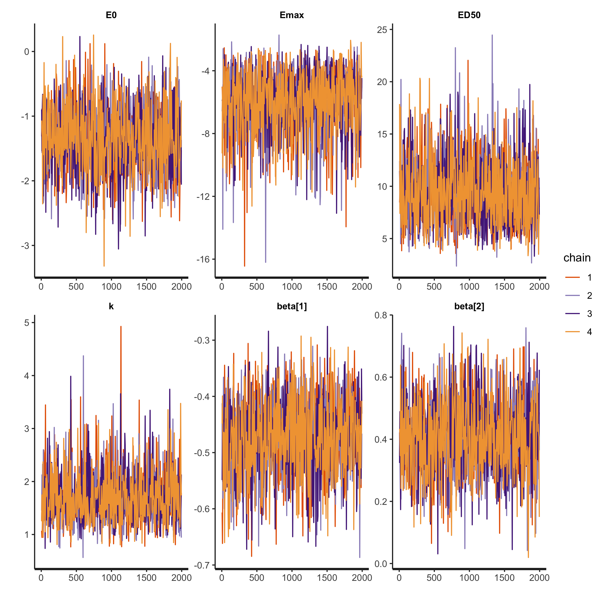
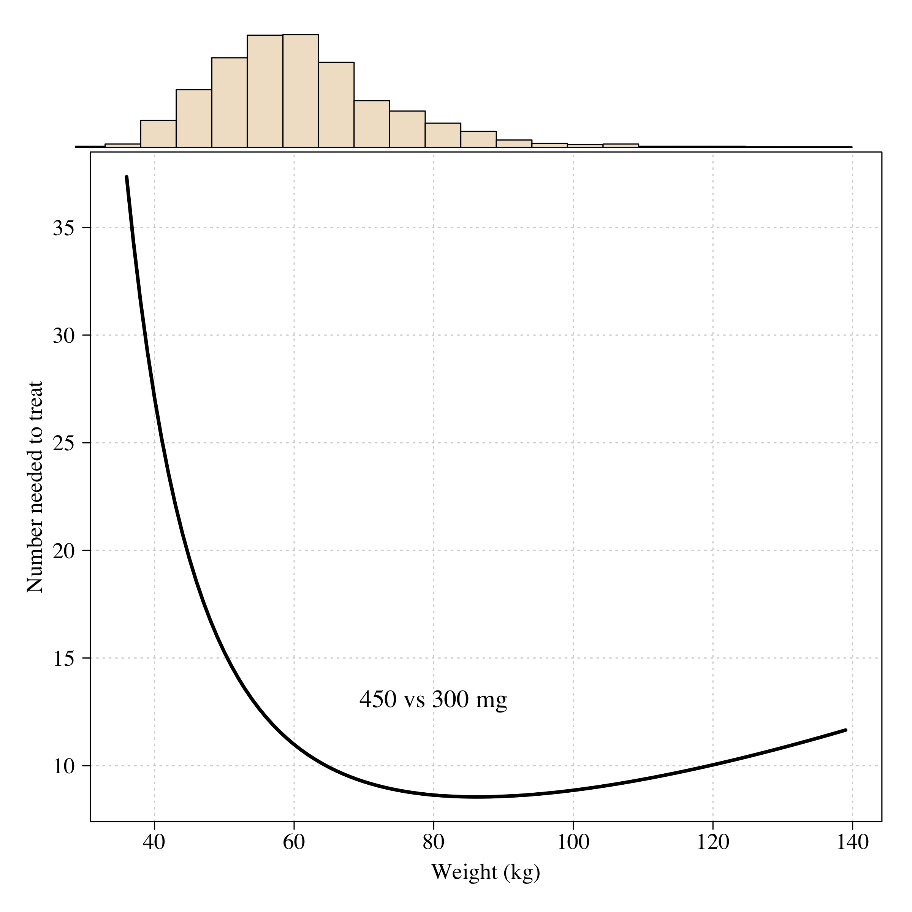

TODO:

-   Run with updated PK output
-   Paper: check effect in volunteers
-   Analysis just with DETECTIVE part 1 (randomised allocation)
-   Boxplot of half lives across regions
-   Association with weight (just in placebo arms)

# Preambule

## Load data


```
## 
## DETECTIVE_Ph2 DETECTIVE_Ph3        GATHER 
##           329           522           251
```

```
## TQ doses in efficacy analyses:
```

```
## 
## No Radical Cure            PQ15           TQ100           TQ300            TQ50 
##             186             265              56             482              55 
##           TQ600 
##              56
```

```
## [1] 482
```

```
## [1] 7.692307
```

```
## [1] 4.929577
```

```
## 27 patients were lost to follow-up before 1 month
```

```
## 39 patients were lost to follow-up before 4 months
```

```
## 125 patients were lost to follow-up before 6 months
```

```
## 
## No Radical Cure            PQ15           TQ100           TQ300            TQ50 
##             182             257              56             469              54 
##           TQ600 
##              55
```

```
## A total of 634 patients received TQ in the efficacy population with doses varying from 0.5 to 14.3 mg/kg
```

```
## 
##   0   1 
## 775 298
```

```
## 
##   0   1 
## 713 360
```

```
## Warning: NAs introduced by coercion
```

# Data summaries

## Table 1


```
##             tqcat tqmgkgtot
## 1 No radical cure  0.000000
## 2              PQ  0.000000
## 3     [0.01,3.75)  1.987331
## 4     [3.75,6.25)  4.893435
## 5     [6.25,8.75)  6.936322
## 6       [8.75,15] 10.696189
```

```
##             tqcat mean   n total
## 1 No radical cure 55.5 101   182
## 2              PQ 22.2  57   257
## 3     [0.01,3.75) 33.7  57   169
## 4     [3.75,6.25) 21.5  79   368
## 5     [6.25,8.75)  7.4   4    54
## 6       [8.75,15]  0.0   0    43
```

```
## mean age:
```

```
##             tqcat age
## 1 No radical cure  35
## 2              PQ  36
## 3     [0.01,3.75)  37
## 4     [3.75,6.25)  36
## 5     [6.25,8.75)  36
## 6       [8.75,15]  33
```

```
## SD age:
```

```
##             tqcat  age
## 1 No radical cure 14.1
## 2              PQ 14.4
## 3     [0.01,3.75) 13.4
## 4     [3.75,6.25) 14.2
## 5     [6.25,8.75) 17.2
## 6       [8.75,15] 14.4
```

```
##             tqcat sex
## 1 No radical cure  50
## 2              PQ  77
## 3     [0.01,3.75)  43
## 4     [3.75,6.25)  95
## 5     [6.25,8.75)  24
## 6       [8.75,15]   9
```

```
##             tqcat sex
## 1 No radical cure  27
## 2              PQ  30
## 3     [0.01,3.75)  25
## 4     [3.75,6.25)  26
## 5     [6.25,8.75)  44
## 6       [8.75,15]  21
```

```
##             tqcat weight
## 1 No radical cure     62
## 2              PQ     63
## 3     [0.01,3.75)     72
## 4     [3.75,6.25)     63
## 5     [6.25,8.75)     51
## 6       [8.75,15]     57
```

```
##             tqcat weight
## 1 No radical cure   12.0
## 2              PQ   12.1
## 3     [0.01,3.75)   20.1
## 4     [3.75,6.25)    8.7
## 5     [6.25,8.75)   13.3
## 6       [8.75,15]    7.3
```

```
##              
##               No radical cure  PQ [0.01,3.75) [3.75,6.25) [6.25,8.75) [8.75,15]
##   Brazil                   55  80          61         105           6         3
##   Cambodia                 10   8           0          16           2         0
##   Colombia                  0   5           0          11           0         0
##   Ethiopia                 14  13           0          18           7         0
##   India                     9   5          21           8           4         7
##   Peru                     62  91          56         136          21        18
##   Philippines               1   2           0           3           0         0
##   Thailand                 31  38          31          46          10        15
##   Vietnam                   0  15           0          25           4         0
```

```
##              
##               No radical cure PQ [0.01,3.75) [3.75,6.25) [6.25,8.75) [8.75,15]
##   Brazil                   30 31          36          29          11         7
##   Cambodia                  5  3           0           4           4         0
##   Colombia                  0  2           0           3           0         0
##   Ethiopia                  8  5           0           5          13         0
##   India                     5  2          12           2           7        16
##   Peru                     34 35          33          37          39        42
##   Philippines               1  1           0           1           0         0
##   Thailand                 17 15          18          12          19        35
##   Vietnam                   0  6           0           7           7         0
```

```
##             tqcat logpara0.0% logpara0.25% logpara0.50% logpara0.75%
## 1 No radical cure          30         2173         5470        11856
## 2              PQ         104         1712         4697        10430
## 3     [0.01,3.75)         129         1447         4320         9456
## 4     [3.75,6.25)         102         1431         4174        10101
## 5     [6.25,8.75)         151         1961         5507        12111
## 6       [8.75,15]         200         1692         6143        13313
##   logpara0.100%
## 1         66010
## 2         87380
## 3         51175
## 4         99604
## 5         80535
## 6         56100
```

```
##             tqcat hbday0.1 hbday0.2
## 1 No radical cure     12.9      1.5
## 2              PQ     13.0      1.6
## 3     [0.01,3.75)     12.9      1.8
## 4     [3.75,6.25)     13.2      1.6
## 5     [6.25,8.75)     12.3      1.8
## 6       [8.75,15]     12.6      1.8
```

## PK data plot

For supplementary materials


```
## Rows: 5248 Columns: 18
```

```
## ── Column specification ────────────────────────────────────────────────────────
## Delimiter: ","
## chr (11): #ID, TIME, AMT, ODV, LNDV, AGE, SEX, BW, ACT, COUNTRY, PID
## dbl  (7): MDV, BLQ, CMT, EVID, TYPE, VOMIT, STUDY
```

```
## 
## ℹ Use `spec()` to retrieve the full column specification for this data.
## ℹ Specify the column types or set `show_col_types = FALSE` to quiet this message.
```

```
## there are a total of 4389 concentrations above LOQ in 718 patients
```

<!-- --><!-- -->

## Kaplan Meier time to recurrence


```
## [1] 182 257 169 368  54  43
```

<!-- -->


```
##              
##               No radical cure  PQ [0.01,3.75) [3.75,6.25) [6.25,8.75) [8.75,15]
##   Brazil                   55  80          61         105           6         3
##   Cambodia                 10   8           0          16           2         0
##   Colombia                  0   5           0          11           0         0
##   Ethiopia                 14  13           0          18           7         0
##   India                     9   5          21           8           4         7
##   Peru                     62  91          56         136          21        18
##   Philippines               1   2           0           3           0         0
##   Thailand                 31  38          31          46          10        15
##   Vietnam                   0  15           0          25           4         0
```

```
## Range of mg/kg weights:
```

```
## [1]  0.55 14.29
```

```
## Median number of methb measurements is 12 (range 2 to 19)
```

```
## 
##   0   1 
## 775 298
```

```
##                  
##                     0   1
##   No radical cure  81 101
##   PQ              200  57
##   [0.01,3.75)     112  57
##   [3.75,6.25)     289  79
##   [6.25,8.75)      50   4
##   [8.75,15]        43   0
```

```
##         Dose (mg) Rec 4 mths (%)     n
## 1 No radical cure           55.5 182.0
## 2              PQ           22.2 257.0
## 3     [0.01,3.75)           33.7 169.0
## 4     [3.75,6.25)           21.5 368.0
## 5     [6.25,8.75)            7.4  54.0
## 6       [8.75,15]            0.0  43.0
```

## CYP2D6


```
## 
## FALSE  TRUE 
##   716   384
```

```
##          
##             0 0.5   1 1.5   2
##   *1/*1     0   0   0   0 407
##   *1/*10    0   0   0  56   0
##   *1/*17    0   0   0  34   0
##   *1/*3     0   0   3   0   0
##   *1/*4     0   0  62   0   0
##   *1/*41    0   0   0  27   0
##   *1/*5     0   0  24   0   0
##   *1/*6     0   0   2   0   0
##   *1/*9     0   0   0  10   0
##   *10/*10   0   0  35   0   0
##   *10/*17   0   0   1   0   0
##   *10/*41   0   0   8   0   0
##   *17/*17   0   0   3   0   0
##   *17/*41   0   0   3   0   0
##   *3/*4     3   0   0   0   0
##   *3/*9     0   1   0   0   0
##   *4/*10    0   1   0   0   0
##   *4/*17    0   2   0   0   0
##   *4/*4     2   0   0   0   0
##   *4/*41    0   7   0   0   0
##   *4/*5     3   0   0   0   0
##   *4/*9     0   1   0   0   0
##   *41/*41   0   0   3   0   0
##   *5/*10    0  14   0   0   0
##   *5/*41    0   1   0   0   0
##   *5/*5     1   0   0   0   0
##   *5/*9     0   1   0   0   0
##   *9/*41    0   0   1   0   0
```

```
## CYP2D6 allele frequencies:
```

```
## 
##   *1  *10  *17   *3   *4  *41   *5   *6   *9 
## 72.1 10.5  3.2  0.5  5.8  3.7  3.1  0.1  1.0
```

```
##       
##          0 0.5   1 1.5   2
##   0      6   0   0   0   0
##   0.25   0  15   0   0   0
##   0.5    3  12  35   0   0
##   0.75   0   0   9   0   0
##   1      0   1  96   0   0
##   1.25   0   0   0  56   0
##   1.5    0   0   5  71   0
##   2      0   0   0   0 407
```

```
##                Activity Score
## CYP2D6 Genotype   0 0.25 0.5 0.75   1 1.25 1.5   2
##         *1/*1     0    0   0    0   0    0   0 407
##         *1/*10    0    0   0    0   0   56   0   0
##         *1/*17    0    0   0    0   0    0  34   0
##         *1/*3     0    0   0    0   0    0   3   0
##         *1/*4     0    0   0    0  62    0   0   0
##         *1/*41    0    0   0    0   0    0  27   0
##         *1/*5     0    0   0    0  24    0   0   0
##         *1/*6     0    0   0    0   0    0   2   0
##         *1/*9     0    0   0    0   0    0  10   0
##         *10/*10   0    0  35    0   0    0   0   0
##         *10/*17   0    0   0    1   0    0   0   0
##         *10/*41   0    0   0    8   0    0   0   0
##         *17/*17   0    0   0    0   3    0   0   0
##         *17/*41   0    0   0    0   3    0   0   0
##         *3/*4     0    0   3    0   0    0   0   0
##         *3/*9     0    0   0    0   1    0   0   0
##         *4/*10    0    1   0    0   0    0   0   0
##         *4/*17    0    0   2    0   0    0   0   0
##         *4/*4     2    0   0    0   0    0   0   0
##         *4/*41    0    0   7    0   0    0   0   0
##         *4/*5     3    0   0    0   0    0   0   0
##         *4/*9     0    0   1    0   0    0   0   0
##         *41/*41   0    0   0    0   3    0   0   0
##         *5/*10    0   14   0    0   0    0   0   0
##         *5/*41    0    0   1    0   0    0   0   0
##         *5/*5     1    0   0    0   0    0   0   0
##         *5/*9     0    0   1    0   0    0   0   0
##         *9/*41    0    0   0    0   1    0   0   0
```

## Basic data plots

weight


```
##       country outcome_primary.1 outcome_primary.2
## 1      Brazil                26               156
## 2    Cambodia                50                18
## 3    Colombia                36                11
## 4    Ethiopia                16                25
## 5       India                 0                 9
## 6        Peru                20               162
## 7 Philippines                 0                 3
## 8    Thailand                11                56
## 9     Vietnam                 7                29
```

```
##       country outcome_primary.1 outcome_primary.2
## 1      Brazil                35               310
## 2    Cambodia                53                36
## 3    Colombia                25                16
## 4    Ethiopia                25                52
## 5       India                 4                54
## 6        Peru                30               384
## 7 Philippines                17                 6
## 8    Thailand                19               171
## 9     Vietnam                 9                44
```

<!-- -->

```
##       country weight
## 1    Ethiopia     53
## 2 Philippines     53
## 3    Thailand     54
## 4    Cambodia     55
## 5     Vietnam     57
## 6       India     60
## 7        Peru     62
## 8    Colombia     67
## 9      Brazil     70
```

## Methb data


```
## There are a total of 9632 mthb measurements in 818 patients
```

```
## Between day 0 and day 20 there are 5816 measurements. Median (range) per patient is 7 (1 to 12)
```

<!-- -->

```
## 
## Call:
## lm(formula = log10(day7_mthb) ~ tqmgkgtot, data = pk_summaries)
## 
## Residuals:
##      Min       1Q   Median       3Q      Max 
## -1.11911 -0.16721  0.00514  0.18448  0.62429 
## 
## Coefficients:
##              Estimate Std. Error t value Pr(>|t|)    
## (Intercept) -0.100671   0.024584  -4.095 4.76e-05 ***
## tqmgkgtot    0.065552   0.004891  13.404  < 2e-16 ***
## ---
## Signif. codes:  0 '***' 0.001 '**' 0.01 '*' 0.05 '.' 0.1 ' ' 1
## 
## Residual standard error: 0.2632 on 648 degrees of freedom
##   (72 observations deleted due to missingness)
## Multiple R-squared:  0.2171,	Adjusted R-squared:  0.2159 
## F-statistic: 179.7 on 1 and 648 DF,  p-value: < 2.2e-16
```

<!-- -->


<!-- -->


<!-- -->

```
## [1] 18.17566
```

```
## 
## Call:
## lm(formula = t_12_terminal_rescaled ~ AS_score <= 0.5, data = outcome_dat)
## 
## Residuals:
##      Min       1Q   Median       3Q      Max 
## -11.9579  -2.2104  -0.4231   2.0385  20.6090 
## 
## Coefficients:
##                     Estimate Std. Error t value Pr(>|t|)    
## (Intercept)          18.8308     0.1894  99.441   <2e-16 ***
## AS_score <= 0.5TRUE  -0.8654     0.6329  -1.367    0.172    
## ---
## Signif. codes:  0 '***' 0.001 '**' 0.01 '*' 0.05 '.' 0.1 ' ' 1
## 
## Residual standard error: 3.573 on 389 degrees of freedom
##   (709 observations deleted due to missingness)
## Multiple R-squared:  0.004783,	Adjusted R-squared:  0.002225 
## F-statistic:  1.87 on 1 and 389 DF,  p-value: 0.1723
```

<!-- -->

# Weight based models of tafenoquine efficacy

## Logistic regression


```
## Using all data (n=1073), the odds ratio for recurrence at 4 months for each additional mg/kg of tafenoquine is 0.7 (95% CI 0.65 to 0.75)
```

```
## Using all data (n=1073), the odds ratio for recurrence at 4 months for each additional mg/kg of primaquine is 0.63 (95% CI 0.55 to 0.71)
```

```
## Using only patients who got a 300 mg dose (n=469), the odds ratio for recurrence at 4 months for each additional mg/kg of tafenoquine is 0.66 (95% CI 0.51 to 0.86)
```

```
## Using all patients (n=1073), the odds ratio for recurrence at 6 months for each additional mg/kg of tafenoquine is 0.72 (95% CI 0.67 to 0.77)
```

```
## Using all patients (n=1073), the odds ratio for recurrence at 6 months for each additional mg/kg of primaquine is 0.61 (95% CI 0.54 to 0.69)
```

## EMAX model


load fits

<!-- --><!-- -->

### Compare EMAX model fits

<!-- -->


Figure 2 in paper: the main mg/kg driving efficacy plot under the EMAX model


```
## [1] 0.2840664
```

```
## [1] 0.2067025
```

```
## [1] 0.1415006
```

```
## The model estimates that a 15 mg/kg TQ dose reduces 98.64% of all recurrences at 4 months
```

```
## The E90 is 7.5 mg/kg
```

```
## The E50 is 3.6 mg/kg
```

<!-- -->

```
## The E95 is 9 mg/kg
```


```
## The E90 is 8.4 mg/kg
```

```
## The E50 is 3.6 mg/kg
```

<!-- -->

```
## The E95 is 10.3 mg/kg
```

dose-response

<!-- --><!-- -->

```
## [1] "mean efficacies:"
```

```
## [1] 68.0794
```

```
## [1] 87.81331
```

compare logistic and EMAX


```
## (Intercept)   pqmgkgtot   tqmgkgtot    logpara0 
##  -1.3718004  -0.4664881  -0.3510041   0.3632042
```

<!-- -->

## Number needed to treat 

weight versus efficacy

<!-- --><!-- -->


overall number needed to treat


```
## Mean recurrence for 300 mg:
```

```
##  2.5%   50% 97.5% 
##  10.1  15.1  21.5
```

```
## Mean recurrence for 450 mg:
```

```
##  2.5%   50% 97.5% 
##   3.5   6.5  11.5
```

```
## Mean recurrence for 600 mg:
```

```
##  2.5%   50% 97.5% 
##   1.0   3.0   7.7
```

<!-- -->

```
## NNT (95%CI):
```

```
##  2.5%   50% 97.5% 
##   7.2  11.8  22.0
```

Compare for different parts of the world


```
## 
##       Africa     Americas Asia-Pacific 
##           55          724          321
```

```
## In Americas the odds ratio for recurrence for each additional mg/kg increase in tafenoquine dose is 0.813 (n=710)
## In Asia-Pacific the odds ratio for recurrence for each additional mg/kg increase in tafenoquine dose is 0.82 (n=311)
## In Africa the odds ratio for recurrence for each additional mg/kg increase in tafenoquine dose is 0.805 (n=52)
```

Compare all ORs for logistic regression models

<!-- -->

# AUC


```
## Using all data (n=634), the odds ratio for recurrence at 6 months for each additional mg/kg of tafenoquine is 0.58 (95% CI 0.44 to 0.75)
```

```
## Using all data (n=634), and adjusted for TQ mg/kg dose, the odds ratio for recurrence at 6 months for each SD in TQ AUC 0.93 (95% CI 0.67 to 1.26)
```

```
## Using patients who got 300 mg (n=469), the odds ratio for recurrence at 6 months for each additional mg/kg of tafenoquine is 0.85 (95% CI 0.66 to 1.09)
```

# CMAX


```
## Using all data (n=634), the odds ratio for recurrence at 6 months for each 2-fold increase in tafenoquine CMAX is 0.55 (95% CI 0.43 to 0.7)
```

```
## Using all data (n=634), and adjusted for TQ mg/kg dose, the odds ratio for recurrence at 6 months for a 2-fold increase in TQ Cmax 0.97 (95% CI 0.66 to 1.4)
```

<!-- -->

```
## Using who got 300 mg (n=469), the odds ratio for recurrence at 6 months for each 10 fold increase in tafenoquine CMAX is 0.43 (95% CI 0.24 to 0.71)
```

# Terminal elimination half-life


```
## 
## Call:
## lm(formula = t_12_terminal_rescaled ~ log(weight) + country, 
##     data = outcome_dat)
## 
## Residuals:
##      Min       1Q   Median       3Q      Max 
## -10.9098  -2.4022  -0.4118   1.8207  21.7340 
## 
## Coefficients:
##                    Estimate Std. Error t value Pr(>|t|)    
## (Intercept)         13.0100     3.3193   3.919 9.83e-05 ***
## log(weight)          1.1396     0.7706   1.479    0.140    
## countryCambodia      1.0189     0.8601   1.185    0.237    
## countryColombia      1.1936     0.9866   1.210    0.227    
## countryEthiopia      0.8401     0.7375   1.139    0.255    
## countryIndia         0.4617     0.6165   0.749    0.454    
## countryPeru          1.8961     0.3707   5.115 4.15e-07 ***
## countryPhilippines   3.0877     1.9975   1.546    0.123    
## countryThailand     -0.0647     0.4760  -0.136    0.892    
## countryVietnam       0.4189     0.7178   0.584    0.560    
## ---
## Signif. codes:  0 '***' 0.001 '**' 0.01 '*' 0.05 '.' 0.1 ' ' 1
## 
## Residual standard error: 3.419 on 639 degrees of freedom
##   (451 observations deleted due to missingness)
## Multiple R-squared:  0.06273,	Adjusted R-squared:  0.04953 
## F-statistic: 4.752 on 9 and 639 DF,  p-value: 3.851e-06
```

<!-- --><!-- -->

```
## 
## 	Pearson's product-moment correlation
## 
## data:  outcome_dat$weight and outcome_dat$t_12_terminal_rescaled
## t = 0.77929, df = 644, p-value = 0.4361
## alternative hypothesis: true correlation is not equal to 0
## 95 percent confidence interval:
##  -0.04655608  0.10757919
## sample estimates:
##        cor 
## 0.03069403
```

```
## Using all data (n=631), the odds ratio for recurrence at 4 months for each additional day in the tafenoquine half life is 1.1 (95% CI 1.04 to 1.17)
```

```
## Using all data (n=631), the odds ratio for recurrence at 4 months for each additional day in the tafenoquine half life is 1.09 (95% CI 1.02 to 1.16)
```

<!-- -->

```
## Using patients given 300 mg (n=467), the odds ratio for recurrence at 4 months for each additional day in the tafenoquine half life is 1.11 (95% CI 1.04 to 1.19)
```

# Methaemoglobin


```
## Using all TQ treated patients (n=569), the odds ratio for recurrence at 4 months for each absolute percentage increase in methaemoglobin is 0.82 (95% CI 0.67 to 0.99)
```

```
## Under the TQ mg/kg dose EMAX model, each absolute percentage point increase in methaemglobin as associated in an odds-ratio for recurrence at 4 months of 0.81 (95% CI 0.66 to 0.98)
```

# Everything


```
## Generalized linear mixed model fit by maximum likelihood (Laplace
##   Approximation) [glmerMod]
##  Family: binomial  ( logit )
## Formula: 
## outcome_primary ~ tqmgkgtot + scale(log(day7_mthb)) + scale(t_12_terminal_rescaled) +  
##     scale(logpara0) + (1 | studysite)
##    Data: outcome_dat
## 
##      AIC      BIC   logLik deviance df.resid 
##    572.6    598.7   -280.3    560.6      560 
## 
## Scaled residuals: 
##     Min      1Q  Median      3Q     Max 
## -1.2834 -0.5550 -0.3959 -0.1528  3.3272 
## 
## Random effects:
##  Groups    Name        Variance Std.Dev.
##  studysite (Intercept) 0.4004   0.6328  
## Number of obs: 566, groups:  studysite, 20
## 
## Fixed effects:
##                               Estimate Std. Error z value Pr(>|z|)    
## (Intercept)                   -0.10876    0.35907  -0.303  0.76197    
## tqmgkgtot                     -0.29114    0.07571  -3.846  0.00012 ***
## scale(log(day7_mthb))         -0.24235    0.15054  -1.610  0.10741    
## scale(t_12_terminal_rescaled)  0.25910    0.11259   2.301  0.02138 *  
## scale(logpara0)                0.13395    0.11708   1.144  0.25257    
## ---
## Signif. codes:  0 '***' 0.001 '**' 0.01 '*' 0.05 '.' 0.1 ' ' 1
## 
## Correlation of Fixed Effects:
##             (Intr) tqmgkg s((7_) s(_12_
## tqmgkgtot   -0.800                     
## scl(lg(7_))  0.346 -0.440              
## scl(t_12__)  0.024 -0.073  0.159       
## scal(lgpr0)  0.076 -0.079  0.023  0.101
```

```
## Full model has 566 datapoints
```

<!-- -->

CYP2D6


```
## 
## FALSE  TRUE 
##   349    34
```

```
##        
##         Brazil Cambodia Colombia Ethiopia India Peru Philippines Thailand
##   FALSE    131       14        7       23     0  133           2       25
##   TRUE       9        4        0        1     0    1           0        9
##        
##         Vietnam
##   FALSE      14
##   TRUE       10
```

```
## Generalized linear mixed model fit by maximum likelihood (Laplace
##   Approximation) [glmerMod]
##  Family: binomial  ( logit )
## Formula: outcome_primary ~ tqmgkgtot + as.numeric(AS_score <= 0.5) + (1 |  
##     studysite)
##    Data: outcome_dat[ind_efficacy & outcome_dat$tqmgkgtot > 0, ]
## 
##      AIC      BIC   logLik deviance df.resid 
##    417.2    433.0   -204.6    409.2      379 
## 
## Scaled residuals: 
##     Min      1Q  Median      3Q     Max 
## -0.8107 -0.5730 -0.5045 -0.3959  2.7971 
## 
## Random effects:
##  Groups    Name        Variance Std.Dev.
##  studysite (Intercept) 0.01831  0.1353  
## Number of obs: 383, groups:  studysite, 15
## 
## Fixed effects:
##                             Estimate Std. Error z value Pr(>|z|)  
## (Intercept)                  0.19208    0.62067   0.309   0.7570  
## tqmgkgtot                   -0.29409    0.12717  -2.313   0.0207 *
## as.numeric(AS_score <= 0.5) -0.09062    0.45034  -0.201   0.8405  
## ---
## Signif. codes:  0 '***' 0.001 '**' 0.01 '*' 0.05 '.' 0.1 ' ' 1
## 
## Correlation of Fixed Effects:
##             (Intr) tqmgkg
## tqmgkgtot   -0.966       
## a.(AS_<=0.5 -0.005 -0.064
```

```
## OR for recurrence for poor versus normal/extensive CYP2D6 metabolisers is 0.9 [95% CI is 0.4 to 2.2]
```

## Phase 1: relationship with DHA/PQP?

<!-- --><!-- -->

```
## 
## Call:
## glm(formula = log10(day7_mthb) ~ tqmgkgtot + TYPE, data = pk_summaries)
## 
## Deviance Residuals: 
##     Min       1Q   Median       3Q      Max  
## -1.1253  -0.1679   0.0104   0.1811   0.6181  
## 
## Coefficients:
##              Estimate Std. Error t value Pr(>|t|)    
## (Intercept) -0.151522   0.036502  -4.151 3.75e-05 ***
## tqmgkgtot    0.064592   0.004908  13.161  < 2e-16 ***
## TYPE         0.062112   0.033011   1.882   0.0603 .  
## ---
## Signif. codes:  0 '***' 0.001 '**' 0.01 '*' 0.05 '.' 0.1 ' ' 1
## 
## (Dispersion parameter for gaussian family taken to be 0.06901405)
## 
##     Null deviance: 57.344  on 649  degrees of freedom
## Residual deviance: 44.652  on 647  degrees of freedom
##   (72 observations deleted due to missingness)
## AIC: 111.87
## 
## Number of Fisher Scoring iterations: 2
```

```
## 
##      CQ    None      AL DHA/PQP 
##     578      24      24      24
```

# Power calculations and trial design


# Power calculations

Superiority of 450 over 300 mg single dose


